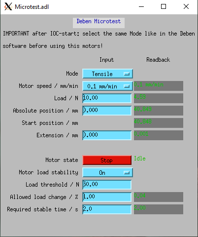

# Deben Microtest EPICS Driver

EPICS asyn driver for controlling a **Deben Microtest tensile/compression stage**.

This driver communicates with the **Deben Microtest vendor software** via the
`DebenMT64.dll`.  
The vendor software **must be running** for the EPICS IOC to connect successfully.

The driver has been tested on:

- Windows 7 (64-bit)
- Windows 10 (64-bit)
- Deben Microtest materials testing system control software V6.2.70

---

## Building:

This repository builds both the Microtest asyn driver and a ready-to-run IOC:

1. Copy the vendor header file `MTDDE.h` into MicrotestApp/src
2. Locate the Deben Microtest DLL on your system. The default installation path is typically: C:\Program Files (x86)\Deben UK Ltd\Microtest DLL\DebenMT64.dll
3. Update the DLL path in the IOC startup script (`st.cmd`) accordingly.

---

## Usage

1. Configure your experiment using the **Deben Microtest vendor software**
(module setup, offsets, etc.).

2. Verify that the stage can be controlled successfully from the vendor software.

3. Start the EPICS IOC.

**Important note about Mode selection**

The Microtest DLL provides functions to **set** the operating mode
(Tensile / Compression), but **no function to read back the current mode**.

Therefore, after starting the IOC, the user **must manually set the Mode PV**
to match the mode currently selected in the vendor software.

---

## Force Stability Logic

The driver optionally supports **force stability detection** to determine when
a motion should be considered *finished*.

When force stability is enabled:

- The motor must have stopped
- The measured force must be above a configurable threshold (note: operation exactly at the threshold could be buggy!)
- The force change must remain within a user-defined percentage
- This condition must be fulfilled continuously for a configurable time

Only when all conditions are met, the `MovingDone` PV is set to **Done**. Motor-states are set consequently, see template-file for motor-PVs.

This is useful for experiments where the mechanical motion stops
before the force has fully stabilized.

All stability parameters (enable switch, threshold, percentage, time)
are configurable via EPICS records at runtime.

---

## Graphical User Interface

The following screenshot shows a typical operator GUI for the Microtest driver:

